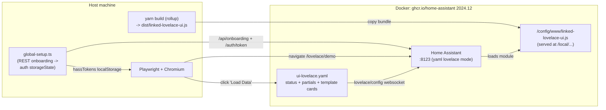
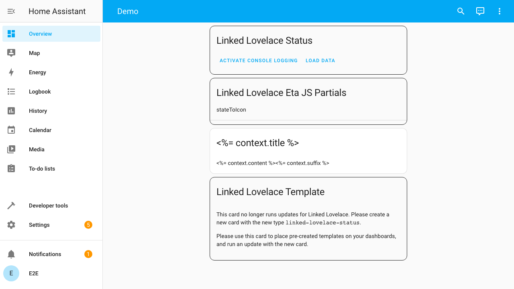
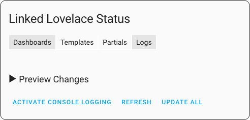
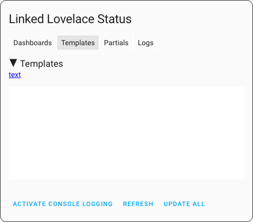
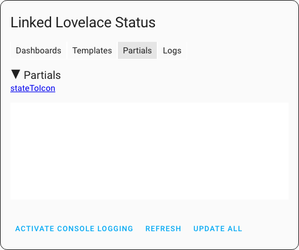
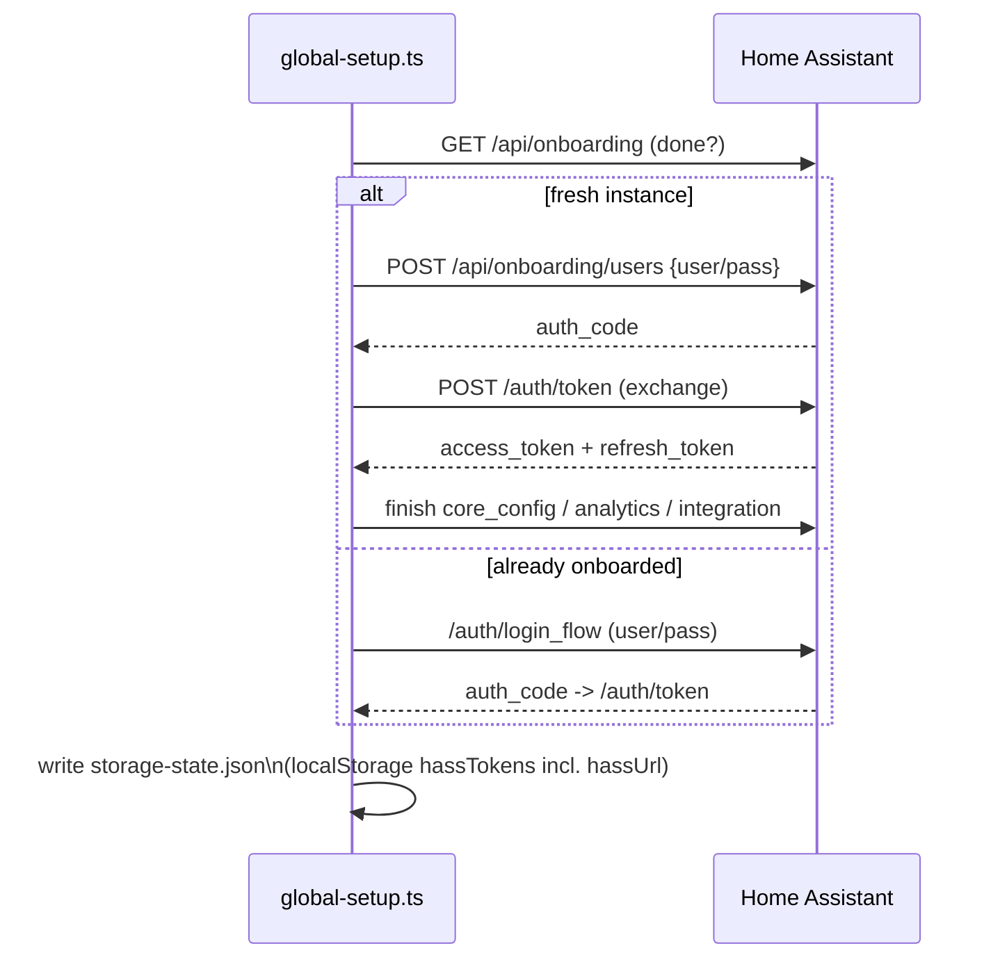

# Linked Lovelace — E2E Demo Environment

End-to-end suite that runs the **built card inside a real Home Assistant**
(Docker) and drives it with Playwright. This validates the layer the Jest unit
tests deliberately **mock**: the live Lovelace websocket API, custom-element
registration, and Lit rendering in a real browser.

## Why this exists (e2e vs unit)

| Concern                          | Jest unit tests        | This e2e suite              |
| -------------------------------- | ---------------------- | --------------------------- |
| Eta template rendering logic     | ✅ (pure functions)    | ➖ (indirect)               |
| `hass.callWS` lovelace API        | ❌ mocked              | ✅ real HA websocket        |
| Custom element registration       | ❌                     | ✅ `customElements.get(...)`|
| Lit `render()` / shadow DOM       | ❌                     | ✅ real Chromium            |
| Template/partial **discovery** from a live dashboard config | ❌ | ✅ `Load Data` → real config |

The unit tests prove the engine is correct in isolation. The e2e suite proves
the card actually wires that engine to Home Assistant and renders.

## Feature coverage

`e2e/tests/features.spec.ts` drives each Linked Lovelace feature through the real
card UI against **writable storage dashboards** (so `Update All` can save the
rendered config back — the round-trip unit tests can't exercise):

| # | Feature                          | What the test does                                              |
| - | -------------------------------- | -------------------------------------------------------------- |
| 1 | Add the controller card          | Seed a dashboard with `custom:linked-lovelace-status`; it renders |
| 2 | Add a template                   | Add an `ll_key` card; `Load Data` discovers it in the Templates tab |
| 3 | Use a template                   | `ll_template` usage → `Update All` → saved card is the rendered template |
| 4 | Modify & sync a template         | Edit the template body, re-sync; usage updates v1 → v2          |
| 5 | Variables in a template          | `<%= context.count %>` + `ll_context:{count:42}` → `Count: 42`  |
| 6 | Create a partial                 | `custom:linked-lovelace-partials`; `Load Data` lists it in Partials tab |
| 7 | Use a local partial              | `<%~ include('iconPartial') %>` inside a template → `mdi:lightbulb` |
| 8 | Nested template                  | A template embeds another (`ll_priority` ordered), forwarding a variable → `INNER:Nested` |

Each test creates an isolated storage dashboard (`lovelace/dashboards/create` +
`lovelace/config/save`), drives the card, reads the saved config back
(`lovelace/config`), and deletes the dashboard afterwards. Helpers live in
`e2e/tests/helpers.ts`.

> Storage dashboards are writable even though the main demo dashboard is in yaml
> mode; the card bundle is loaded for **all** dashboards via
> `frontend.extra_module_url` (not a lovelace `resources:` entry, which would only
> cover the yaml dashboard).

## Architecture



## Walkthrough (captured from the live e2e demo)

These screenshots are generated straight from the running suite via
`./scripts/screenshots.sh` (see "Regenerating screenshots" below), so they
always reflect the real card in a real Home Assistant.

**1. The demo dashboard** — the self-contained `ui-lovelace.yaml`: the status
card, the Eta partials card (`stateToIcon`), a raw `ll_key: text` template
definition, and the template-usage card with its migration notice.



**2. After clicking _Load Data_** — the status card drives the live Lovelace
websocket API, then reveals the Dashboards/Templates/Partials/Logs tabs and the
`Refresh` / `Update All` controls.



**3. Templates tab** — the `text` template was **discovered from the live
dashboard config** (not a mock) and is listed for inspection.



**4. Partials tab** — the `stateToIcon` Eta partial, likewise discovered live.



## How the auth shortcut works

A fresh HA requires onboarding + login. `global-setup.ts` does this headlessly
over REST and writes a Playwright `storageState`:



> ⚠️ The stored `hassTokens` object **must** include `hassUrl`. Without it the HA
> frontend crashes during bootstrap (`Cannot read properties of undefined
> (reading 'substr')`). This was the main integration gotcha.

## Run it

```bash
# one-shot: build -> start HA -> wait -> run Playwright -> tear down
./scripts/e2e.sh

# keep HA running afterwards (fast iteration)
KEEP_UP=1 ./scripts/e2e.sh

# against an already-running HA
cd e2e && npx playwright test
cd e2e && npx playwright test --ui    # interactive
```

Prereqs: Docker, Node, and `yarn`. First run pulls the HA image (~slow) and
installs the Chromium Playwright browser.

### Regenerating screenshots

```bash
./scripts/screenshots.sh   # build -> ensure HA up -> capture -> docs/imgs/e2e/
```

Uses a separate Playwright config (`e2e/playwright.screenshots.config.ts`,
testDir `e2e/screenshots/`) so the CI e2e gate never depends on or writes
documentation artifacts.

## Files

| Path                              | Purpose                                            |
| --------------------------------- | -------------------------------------------------- |
| `scripts/e2e.sh`                  | Orchestrates build → HA up → wait → test → down    |
| `scripts/screenshots.sh`          | Captures the doc screenshots in `docs/imgs/e2e/`   |
| `e2e/playwright.screenshots.config.ts` | Screenshot-only config (excluded from CI gate) |
| `.github/workflows/e2e.yml`       | CI: runs the e2e suite on PRs to `master`          |
| `e2e/docker-compose.yml`          | Home Assistant service (port 8123)                 |
| `e2e/ha-config/configuration.yaml`| `default_config`, yaml lovelace mode, demo entities|
| `e2e/ha-config/ui-lovelace.yaml`  | Self-contained demo dashboard (no external URLs)   |
| `e2e/global-setup.ts`             | REST onboarding/login → auth `storageState`        |
| `e2e/playwright.config.ts`        | Playwright config (baseURL, storageState)          |
| `e2e/tests/linked-lovelace.spec.ts` | Core checks: registration / render / live discovery |
| `e2e/tests/features.spec.ts`      | Feature coverage (the 8 features above)            |
| `e2e/tests/helpers.ts`            | Storage-dashboard + status-card test helpers       |

## Current status

- ✅ HA demo runs in Docker; freshly built card served at `/local/`.
- ✅ Onboarding/login fully automated (idempotent).
- ✅ 12/12 e2e tests pass: 4 core checks + 8 feature checks (add controller card,
  add/use/modify+sync templates, variables, create/use partials, nested templates).
- ✅ 102/102 Jest unit tests still pass (`yarn test`).
- ✅ CI gate: `.github/workflows/e2e.yml` runs the suite on every PR to `master`.
- ✅ Doc screenshots auto-generated from the live demo (`scripts/screenshots.sh`).

## Possible next steps

- Exercise online partials (`partials[].url`) against a stubbed HTTP endpoint.
- Add `ll_keys` (key remapping) and HA `sections`-layout coverage.
- Visual snapshot diffing of the rendered status card.
