# API Evolution & Architecture Patterns

This document details the technical evolution of the API and architecture from the initial commit through the v2 modernization, using interactive Mermaid diagrams to visualize key patterns and transformations.

---

## Architecture Evolution Timeline

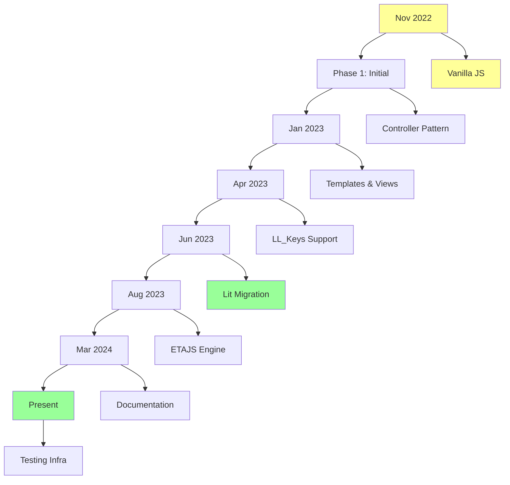

---

## API Evolution: Before v1 → After v1

### Initial Commit Architecture (Pre-Template)

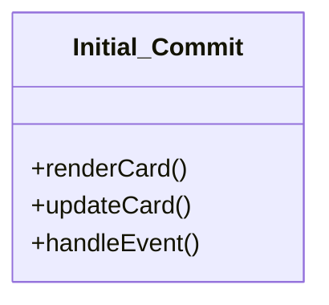

- **Simple DOM Manipulation**
- **Basic Configuration Parsing**
- **Direct Data Binding**

### Controller Refactor (Jan 2023)

```mermaid
classDiagram
    class Controller {
        +init()
        +render()
        +update()
        +dispose()
    }
    
    class TemplateEngine {
        +renderTemplate()
        +processVariables()
        +cacheTemplates()
    }
    
    class StateManager {
        +config: Config
        +templates: {}()
        +partials: {}()
        +update(context)
    }
    
    Controller --> StateManager : manages
    Controller --> TemplateEngine : uses
```

### Key API Changes

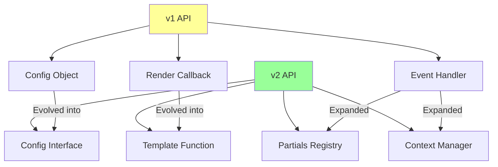

---

## State Evolution Diagram

### v1 State Flow

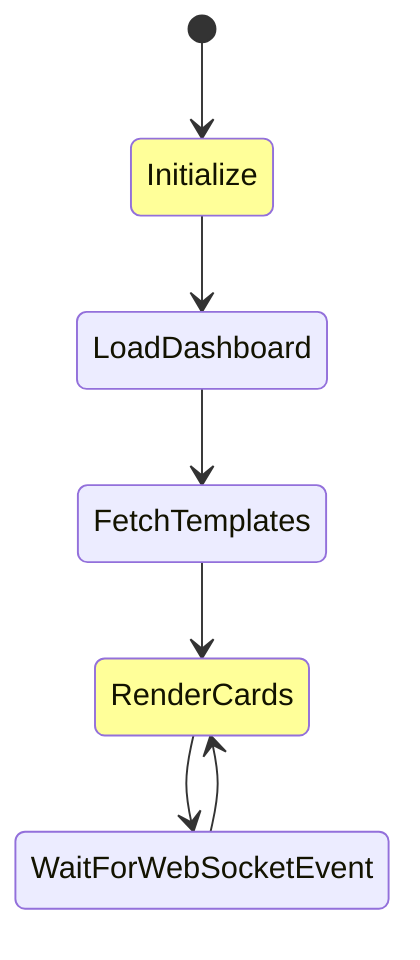

### v2 State Flow

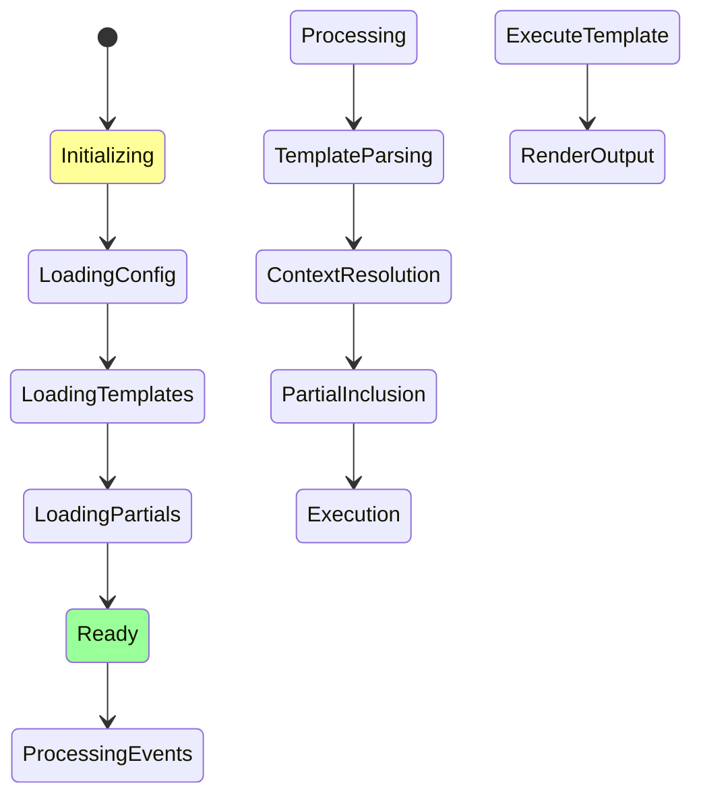

---

## Template Engine Evolution

### v1 Custom Syntax System

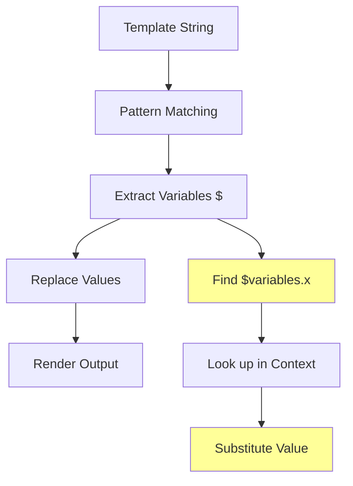

**Example v1 Template:**
```yaml
template: "Your temperature: $variables.temperature$°F"
```

### v2 ETAJS System

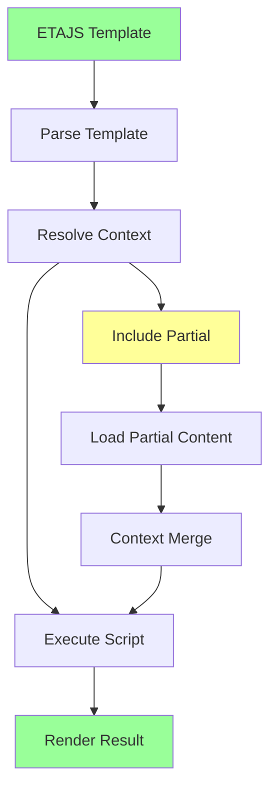

**Example v2 Template:**
```yaml
template: |
  <% let temp = context.temperature %>%
  <%= temp %>°F
```

---

## Partials System Architecture

### Partials Lifecycle

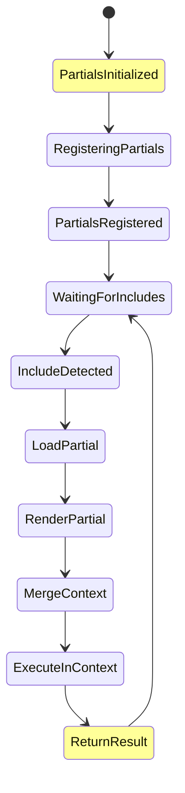

### Partials Registry Structure

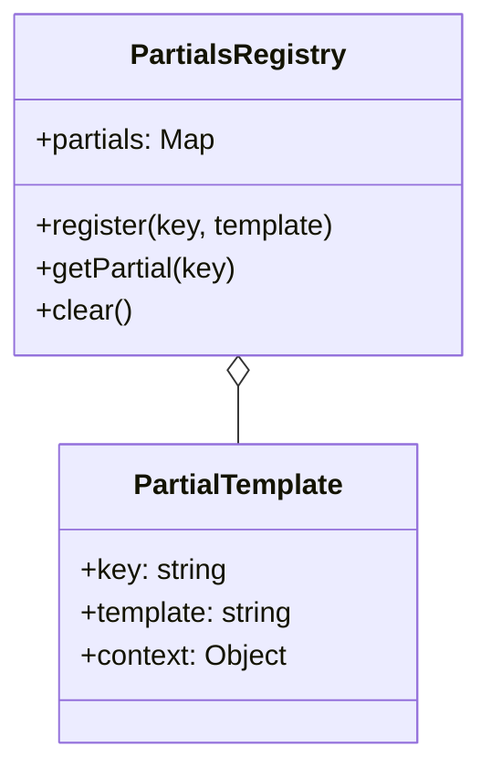

---

## Context Inheritance Pattern

### Context Flow Diagram

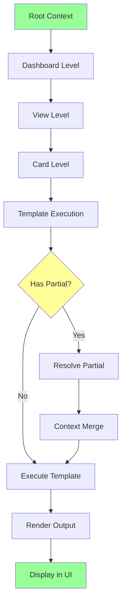

### Context Inheritance Hierarchy

```mermaid
graph TB
    A[ll_context Root] --> B[Dashboard Context] --> C[View Context] --> D[Card Context]
    
    B --> E[View Variables]
    B --> F[Dashboard Variables]
    
    C --> G[View Variables]
    
    D --> H[Card Variables]
    
    E --> I{Context Available?}
    F --> I
    G --> I
    H --> I
    
    A fill:#9f9
    I fill:#ff9
```

---

## Template Resolution Strategy

### Resolution Algorithm

```mermaid
flowchart TD
    A[Template Request] --> B{Is Template Valid?}
    
    B -->|No| C[Return Error]
    B -->|Yes| D{Has ll_template?}
    
    D -->|Yes| E[Load Named Template]
    D -->|No| F[Process Inline Template]
    
    E --> G{Template Cachable?}
    F --> G
    
    G -->|Yes| H[Load From Cache]
    G -->|No| I[Parse Template]
    
    I --> J{Has Include?}
    
    H --> J
    
    J -->|Yes| K[Resolve Partials]
    J -->|No| L[Execute Template]
    
    K --> L
    L --> M[Render Output]
    
    C fill:#ff9
    M fill:#9f9
```

### Template Cache Strategy

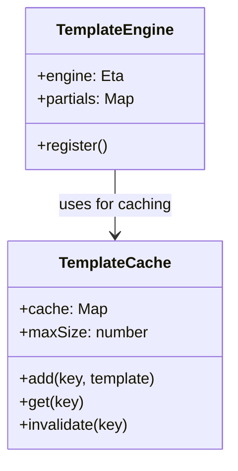

---

## Event Flow Diagram

### Full Event Lifecycle

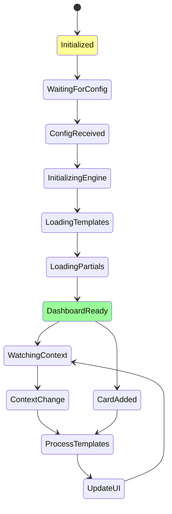

---

## v2 Modernization Changes

### Why Rewrite?

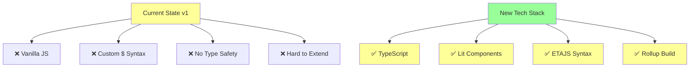

### Migration Strategy

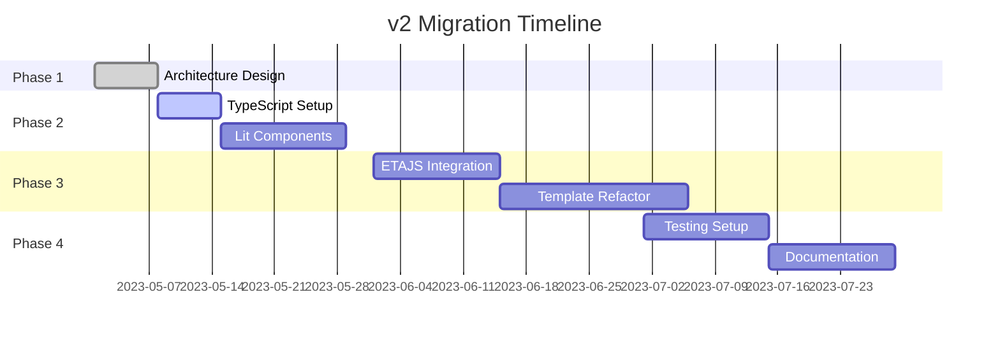

---

## Testing Architecture

### Test Strategy Overview

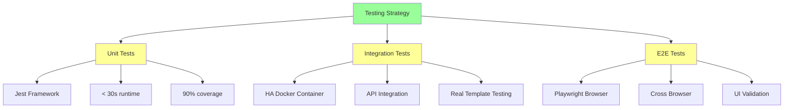

### CI/CD Pipeline

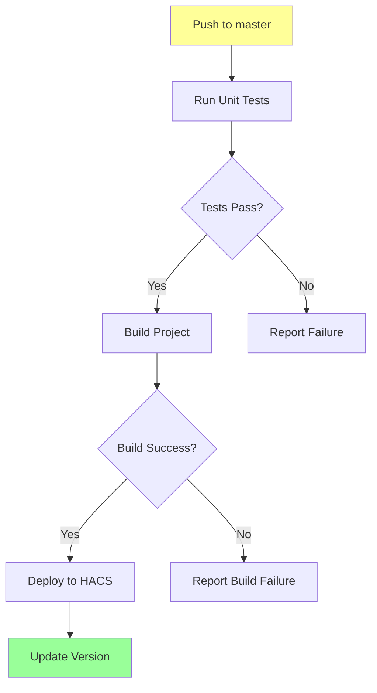

---

## Configuration Schema Evolution

### v1 Configuration

```mermaid
graph LR
    A[config.yaml] --> B[templates:]
    B --> C[template: "key"]
    C --> D[view: "Main"]
    D --> E[sections:]
    E --> F[subsections:]
    F --> G[card: "type"]
    
    style A fill:#ff9
```

**v1 Example:**
```yaml
views:
  - title: Main
    subsections:
      - view: true
        card: |
          $variables.temperature$°F
        type: custom:linked-lovelace
```

### v2 Configuration

```mermaid
graph LR
    A[config.yaml] --> B[ll_templates:]
    B --> C[dashboard:]
    C --> D[title:]
    C --> E[views:]
    E --> F[tabs:]
    F --> G[card:]
    G --> H[ll_template:]
    G --> I[ll_context:]
    
    style A fill:#9f9
    style G fill:#9f9
```

**v2 Example:**
```yaml
ll_templates:
  temperature-card: |
    temperature <%= context.temperature %>°F

dashboard: my-dashboard
ll_context:
  temperature: 72
  mode: passive
```

---

## Card Rendering Flow

### Card Lifecycle

```mermaid
stateDiagram
    [*] --> ParsingConfiguration
    
    ParsingConfiguration --> ConfigParsed
    
    ConfigParsed --> InitializeTemplates
    InitializeTemplates --> TemplatesLoaded
    
    TemplatesLoaded --> InitializePartials
    InitializePartials --> PartialsLoaded
    
    PartialsLoaded --> InitializeController
    InitializeController --> ControllerReady
    
    ControllerReady --> CreateElements
    CreateElements --> AttachElements
    AttachElements --> RenderCards
    
    RenderCards --> DisplayCards
    
    DisplayCards --> WatchingUpdates
    
    WatchingUpdates --> ContextChanged
    ContextChanged --> RenderCards
    
    watchingUpdates --> TemplateChanged
    TemplateChanged --> RenderCards
    
    style ControllerReady fill:#ff9
    style DisplayCards fill:#9f9
```

---

## Summary of Evolution

### Key Transformation Points

1. **Initial Commit** → Simple editor card
2. **Jan 2023** → Controller refactoring
3. **Jan-Apr 2023** → Core feature expansion
4. **Jun-Aug 2023** → v2 modernization rewrite
5. **Mar 2024** → Documentation site launch
6. **Feb 2026** → Comprehensive testing infrastructure

### Current State Capabilities

✅ **Modern Architecture**: TypeScript + Lit + ETAJS  
✅ **Flexible Templates**: Nested, reusable, partially-based  
✅ **Context Management**: Hierarchical inheritance  
✅ **Performance**: Cached templates, optimized rendering  
✅ **Developer Experience**: Testing, docs, CI/CD  

---

**Last Updated**: 2026-02-27  
**Status**: Active Development
