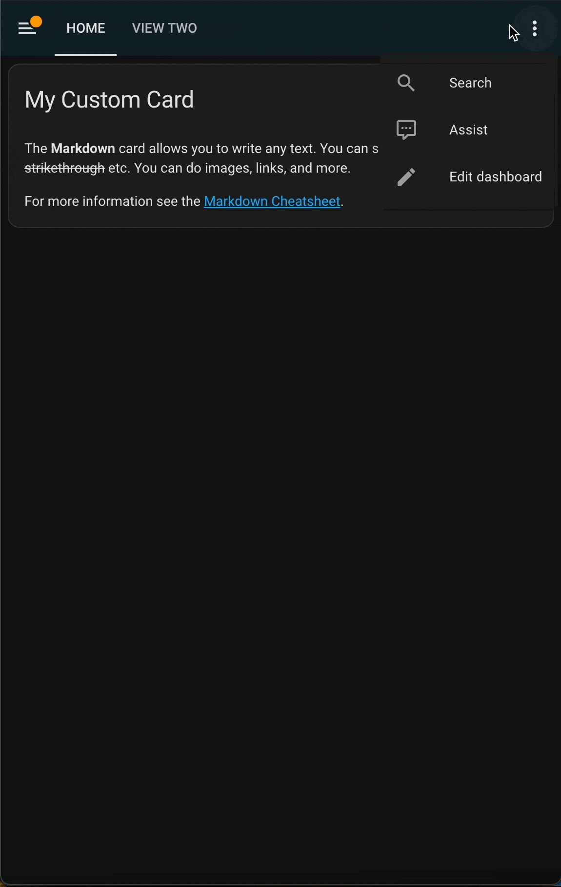
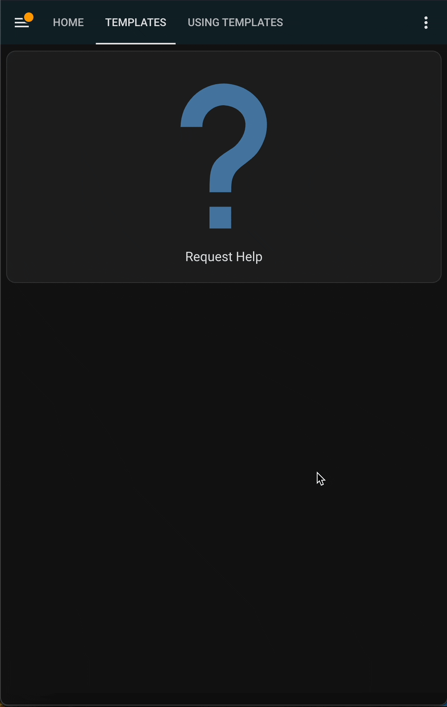
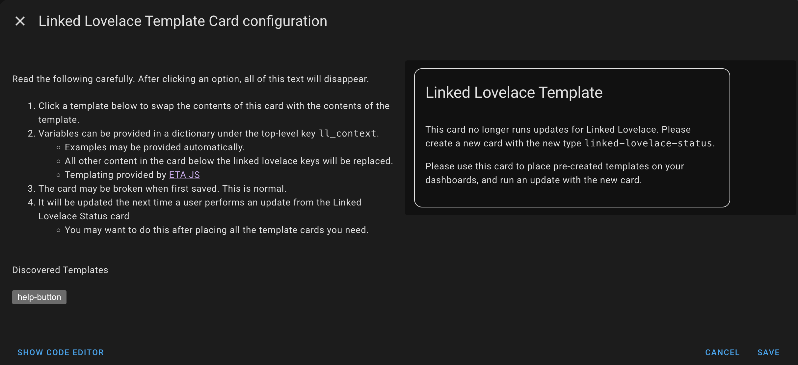
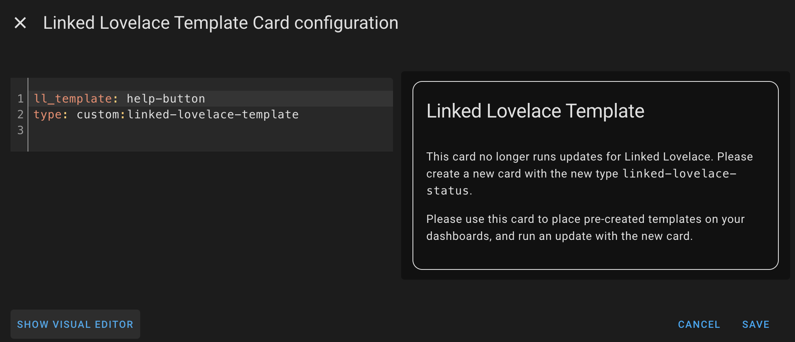
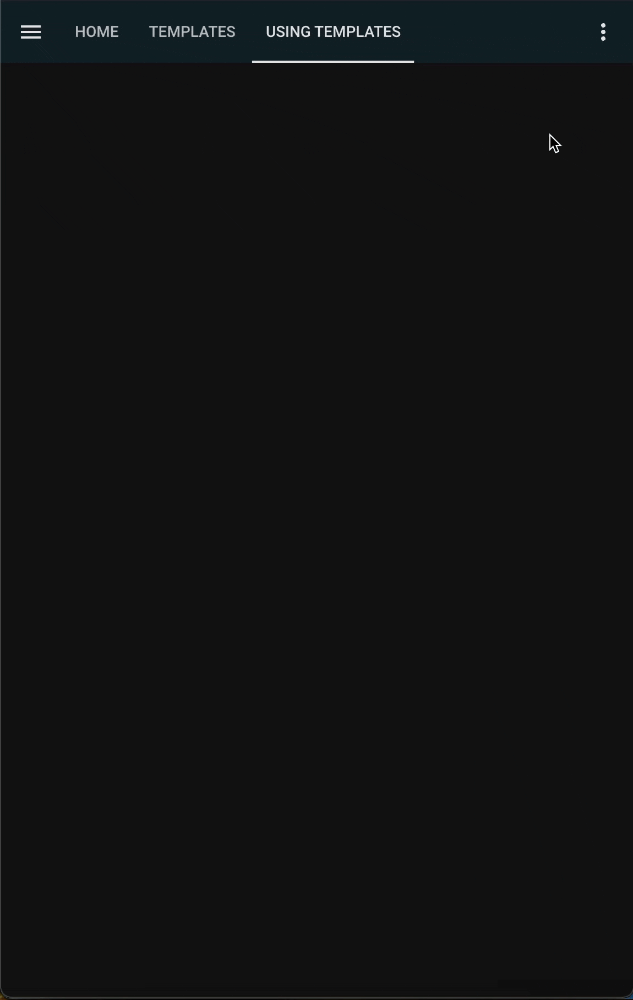

# Creating Your First Template

::: danger NOTE

Linked Lovelace runs commands on behalf of the user's browser to modify dashboard configurations, not on behalf of the Home Assistant system. A user's access may modify the outcome of the program.

__Always back-up your configs if you feel unsure about what you are about to do!__
:::

## What defines a card as reusable?

In our case, it would be a card that we want to use multiple times.

Without Linked Lovelace, the only way to synchronize a card made in the UI is to copy the code in the code editor, and paste it where you want the update to go.

*The Copy Paste Method*


For our example, we'll be creating a button card that creates a persistent notification to help demonstrate synchronization.

## Making a card into a template

To mark a card as a template for Linked Lovelace to consume, we need to add the key `ll_key` to the top-level of the card's YAML. This will break the UI editor.

Before:

```yaml
show_name: true
show_icon: true
type: button
tap_action:
  action: call-service
  service: notify.persistent_notification
  target: {}
  data:
    message: A user needs help
    title: Help Wanted!
icon: mdi:help
name: Request Help
```

After:

```yaml
ll_key: help-button
show_name: true
show_icon: true
type: button
tap_action:
  action: call-service
  service: notify.persistent_notification
  target: {}
  data:
    message: A user needs help
    title: Help Wanted!
icon: mdi:help
name: Request Help
```

By adding this single line Linked Lovelace becomes able to identify `help-button` as a template.

*Converting a card into a template*


## Use the template

Now that we've created our first template, we'll use the Template card to help us place it on a new Dashboard/View. We can do this in one of two ways.

1. Use the UI Selector to choose the Linked Lovelace Template card `type: custom:linked-lovelace-template`. This card will look up our available templates, and swap the code needed for the Status card to work properly into place with just a button click.

2. Modify any new or existing card yaml to have the top level key `ll_template` with a value that matches the `ll_key` value we created earlier. In our example. this would be `help-button`.


*Using a template, both ways*


## Synchronize the template

While we've created our template and placed it on a dashboard, we haven't actually done anything with it yet. To see the power of Linked Lovelace, we'll want to make a change to our original card and synchronize that to where we used the template.

Before moving onto the next step, update your original card, the one with `ll_key` to have some difference. Any at all! It can be purely in the code editor, but it's much more satisfying to see some visual change get synchronized.

For our example, we'll edit the message just slightly.

Before:

```yaml
ll_key: help-button
show_name: true
show_icon: true
type: button
tap_action:
  action: call-service
  service: notify.persistent_notification
  target: {}
  data:
    message: A user needs help
    title: Help Wanted!
icon: mdi:help
name: Request Help
```

After:

```yaml
ll_key: help-button
show_name: true
show_icon: true
type: button
tap_action:
  action: call-service
  service: notify.persistent_notification
  target: {}
  data:
    message: A user clicked help
    title: Help Wanted!
icon: mdi:help
name: Request Help
```

Once that's done, move ahead to get started [using the Status card](./using-the-status-card)

# Using Jinja2 Templating (Advanced)

By default, Linked Lovelace uses the EtaJS template engine for all template rendering. If you want to use Jinja2-style templates (for example, to match Home Assistant's native template syntax), you can opt-in on a per-card basis by adding the `ll_template_engine` field to your card config:

```yaml
ll_template: help-button
ll_template_engine: jinja2  # Use Jinja2 instead of EtaJS for this card
ll_context:
  my_variable: my_value
# ...rest of your card config...
```

- If `ll_template_engine` is not set, EtaJS will be used for backwards compatibility.
- If set to `jinja2`, the card will be rendered using Jinja2. 
- All other features and configuration remain the same.

**Example Jinja2 template usage:**

```yaml
ll_key: jinja2-example
show_name: true
type: button
tap_action:
  action: call-service
  service: notify.persistent_notification
  data:
    message: "Hello, {{ my_variable }}!"
icon: mdi:help
name: Jinja2 Example
```

And to use this template:

```yaml
ll_template: jinja2-example
ll_template_engine: jinja2
ll_context:
  my_variable: 'World'
```

This will render the message as "Hello, World!" using Jinja2 syntax.

> **Note:**
> You can use the `ll_template_engine` field for both main templates and partials. This allows you to define partials using either EtaJS or Jinja2 syntax. For Jinja2, partials should be written as macros, and all macros from partials will be injected at the top of your template automatically.

---

For most users, you do not need to set `ll_template_engine` unless you specifically want Jinja2 syntax. All existing templates will continue to work as before.