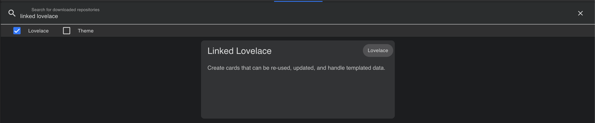
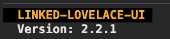
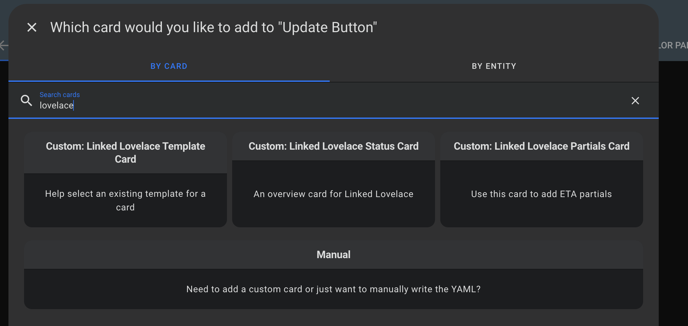

# Getting Started

## Installation

### Prerequisites

- [Home Assistant](https://www.home-assistant.io/)
- [Home Assistant Community Store](https://hacs.xyz/) or knowledge of how to manually install from Github.

::: danger NOTE

Linked Lovelace runs commands on behalf of the user's browser to modify dashboard configurations, not on behalf of the Home Assistant system. A user's access may modify the outcome of the program.

__Always back-up your configs if you feel unsure about what you are about to do!__
:::

### Preferred Setup

Find us in the HACS plugin in `frontend` under `Linked Lovelace UI`

## Up and Running

The plugin should inject itself when loading any dashboard in Home Assistant. This can be confirm in the browser logs, which also includes a version number.

Once injected, the custom card type `type: custom:linked-lovelace-status` should be available. 

If it loads successfully, then we are up and running!

## What's Next?

Now that we have Linked Lovelace installed, it's time to learn how to use it! Move ahead to learn how to [create your first template](./create-your-first-template)
