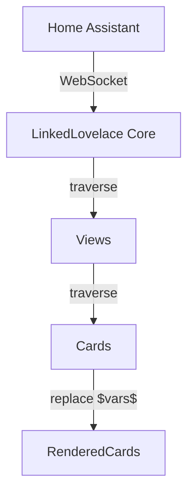
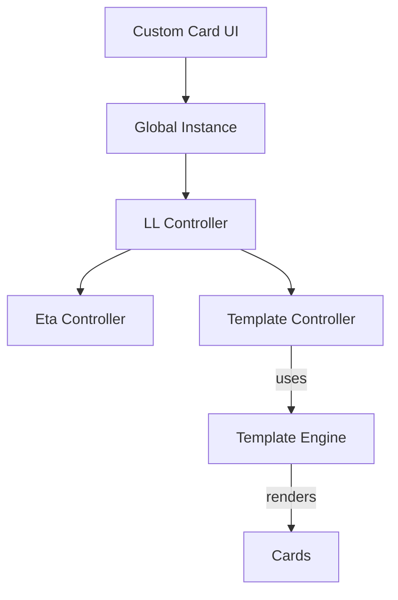
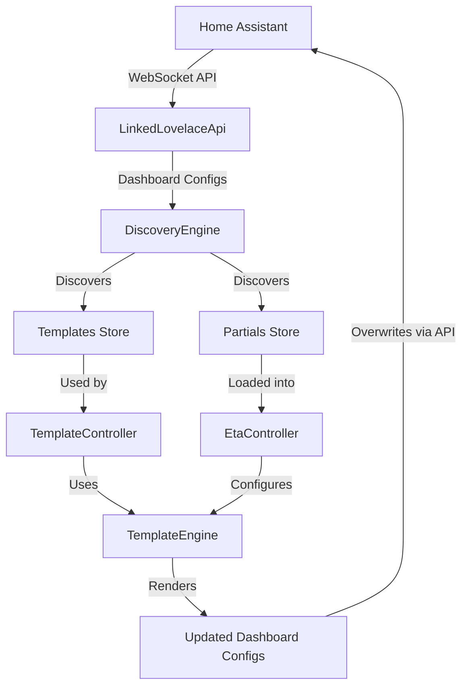

# Project History

## Evolution of Linked Lovelace

### v1.0.0: The Inception
The project started with a single-file core approach.

**Architecture**:
- Core logic in `src/linked-lovelace.ts`.
- Simple recursive traversal of Home Assistant dashboard configurations.

**Templating Engine**:
- Relied on `JSON.stringify` and `string.replaceAll`.
- Used `$VARIABLE_NAME$` syntax for substitution.

### v1.3.3: The Recursion Regression
A major regression was identified where nested templates could cause a stack overflow.

**Issue**: Infinite recursion occurred if a template referenced itself or if deep nesting exceeded the stack limit.
**Fix**: Logic was added to ensure that if a node was processed as a template, its children were not automatically traversed again unless explicitly handled by the substitution logic.

### v2.0.0: Modernization and Eta
The architecture was completely revamped to support more powerful templating and better maintainability.

**Architecture**:
- Transitioned to a multi-controller pattern.
- Introduced `EtaTemplateController`, `TemplateController`, and `HassController`.
- Used a Global Singleton to manage these controllers.

**Templating Engine**:
- Switched to the [Eta](https://eta.js.org/) engine.
- Support for partials and complex logic within templates.
- Introduced namespaced keys like `ll_template`, `ll_context`, and `ll_keys` to prevent collisions with standard Home Assistant card properties.

## The Optimal System
Based on the evolution of the project, an optimal system should aim for:

- **Strict Separation of Concerns**: Clear boundaries between the Home Assistant API, the Templating Engine, and the UI.
- **Robust Traversal**: Use non-recursive traversal with cycle detection or controlled depth limits.
- **Performance**: Pre-compilation of templates and efficient caching of partials.
- **Type Safety**: Full TypeScript support for all dashboard entities to catch errors at compile-time.
- **Isolation**: Unit tests that can run without a live Home Assistant connection.

