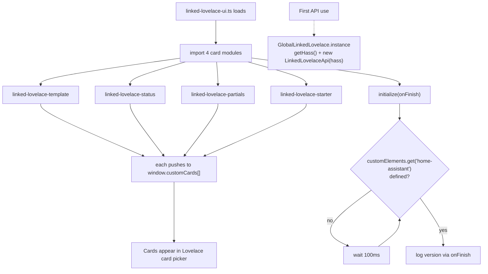
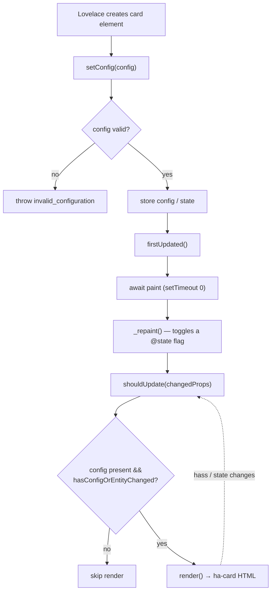
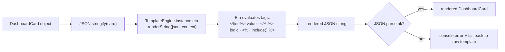
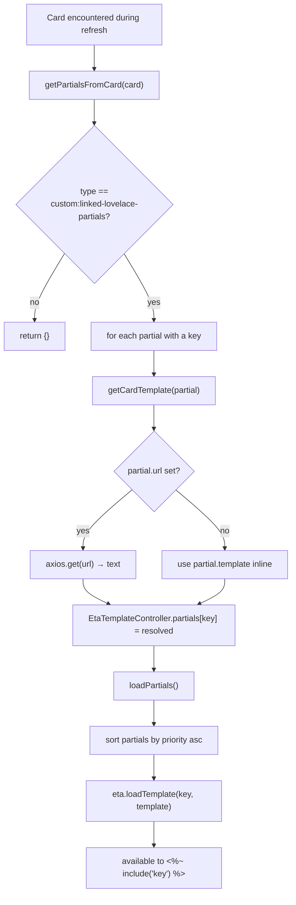
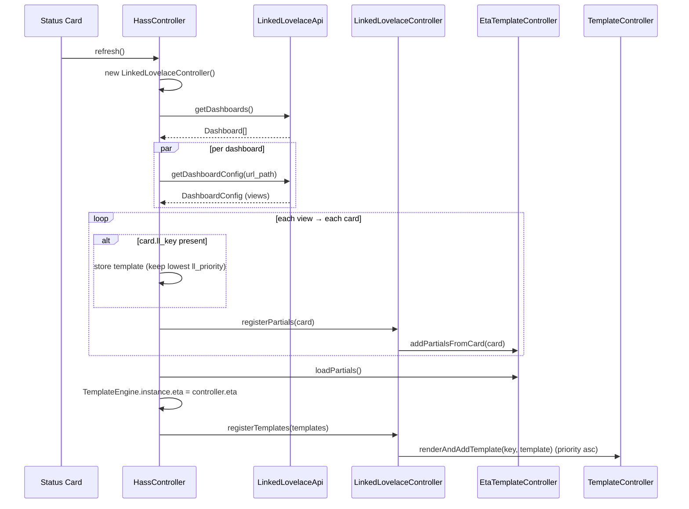
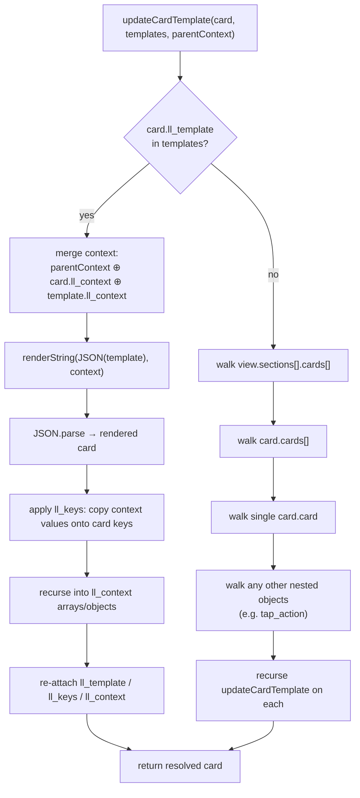
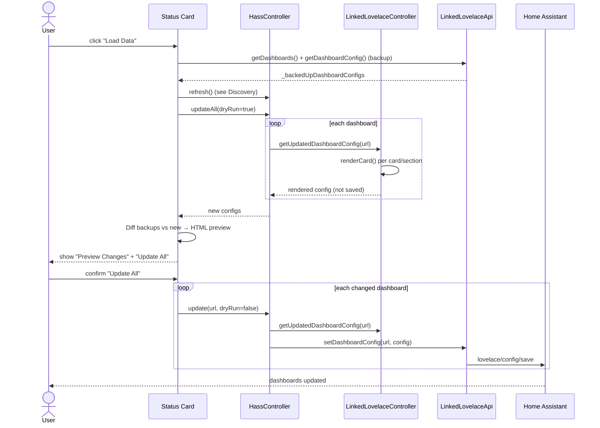
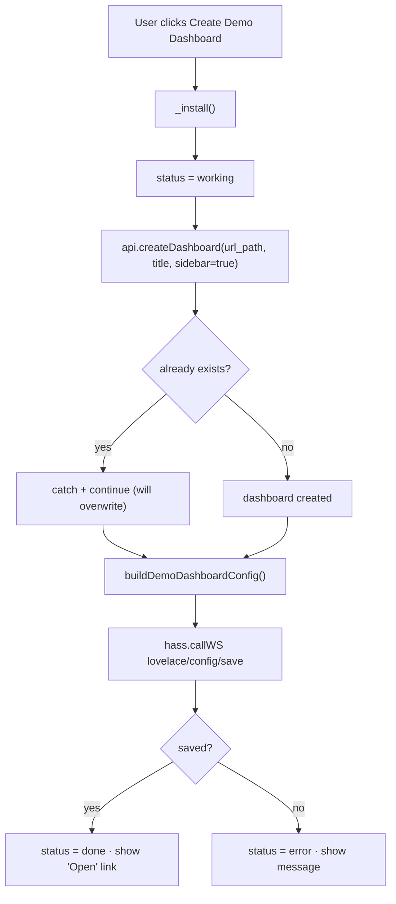
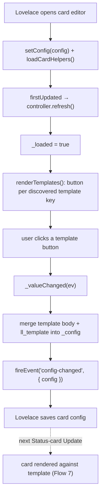

# Lifecycles

This page maps **every flow inside Linked Lovelace** — from the moment the
bundle loads in your browser through to writing rendered dashboards back to Home
Assistant. Each section pairs a short description with a Mermaid diagram so you
can follow the exact sequence of classes and methods involved.

The cast of characters referenced throughout:

| Piece | File | Role |
| --- | --- | --- |
| `GlobalLinkedLovelace` | `src/instance.ts` | Singleton holding `hass` + the API client |
| `LinkedLovelaceApi` | `src/linked-lovelace-api.ts` | Thin wrapper over Home Assistant WebSocket calls |
| `HassController` | `src/controllers/hass.ts` | Orchestrates discovery, dry-run, and updates |
| `LinkedLovelaceController` | `src/v2/linkedLovelace.ts` | Renders a dashboard config with templates |
| `TemplateController` | `src/controllers/template.ts` | Registry of card templates + render entry |
| `EtaTemplateController` | `src/controllers/eta.ts` | Registry of Eta partials |
| `TemplateEngine` | `src/v2/template-engine.ts` | Eta.js engine singleton |

## 1. Bundle load & initialization

The entry module imports all four cards (each self-registers in
`window.customCards`) and calls `initialize()`, which simply waits until Home
Assistant's `home-assistant` element exists before logging the version. The
`GlobalLinkedLovelace` singleton is created lazily the first time any card needs
the API.

## 2. Shared Lit card lifecycle

Every card is a `LitElement` and follows the same reactive cycle. `setConfig`
validates and stores config; `firstUpdated` yields a frame then forces a repaint;
`shouldUpdate` gates re-renders via `hasConfigOrEntityChanged`.

## 3. Template engine rendering

`TemplateEngine` wraps a single Eta instance configured with
`varName: 'context'` and `autoEscape: false`. Rendering takes a card serialized
to JSON, runs it through Eta with a context object, then parses the result back
into a card.

## 4. Partials: discovery & loading

Partials live on `custom:linked-lovelace-partials` cards. During discovery each
partial is resolved — a `url` partial is fetched with axios (its text becomes
`template`), an inline partial is used directly. `loadPartials` then registers
every partial that has template text into the Eta engine, **sorted by priority
(lowest first)**, so they can be pulled in with `<%~ include('key') %>`.

## 5. Discovery / refresh

`HassController.refresh()` rebuilds a fresh `LinkedLovelaceController`, lists all
dashboards (prepending `overview`), fetches every config in parallel, then walks
each view's cards collecting templates (`ll_key`) and partials. Finally it loads
partials and registers templates into the engine.

## 6. Context resolution (`updateCardTemplate`)

The recursive heart of rendering. When a card has `ll_template`, context is
merged from three layers, the template is rendered through Eta, `ll_keys` remap
selected context values onto the card, and nested `ll_context` arrays/objects
recurse. When a card has **no** template, the function instead walks `sections`,
`cards`, `card`, and any nested objects so deeply-placed templates still render.

## 7. Full dashboard sync (main user flow)

Triggered from the **Status card**. `Load Data` backs up every current config,
runs `refresh()`, then a **dry-run** (`updateAll(true)`) that renders configs in
memory and diffs them against the backups to build an HTML preview. Only when the
user confirms `Update All` does it write each changed dashboard back via
`setDashboardConfig` (`lovelace/config/save`).

::: tip Per-dashboard updates
The same flow powers the per-dashboard **Update** button — it calls
`overwriteDashboard(key)` → `update(key, dryRun=false)` for a single dashboard
instead of looping over all changed ones.
:::

## 8. Starter / demo install

The Starter card's `Create Demo Dashboard` button calls `_install()`, which
tries to create the dashboard (ignoring "already exists" errors), then saves a
fully self-contained demo config built by `buildDemoDashboardConfig()`.

## 9. Editor flows

**Template editor** (`linked-lovelace-template-editor`): after `firstUpdated`
runs a `refresh()` to discover templates, it renders one button per template.
Clicking a button copies the template's body into the card config and fires a
`config-changed` event so Lovelace persists it. The **Status editor** is
minimal — it just loads card helpers and renders.

## API surface

The diagrams above bottom out in these Home Assistant WebSocket calls, all
wrapped by `LinkedLovelaceApi` (`src/linked-lovelace-api.ts`):

| Method | WebSocket type | Used by |
| --- | --- | --- |
| `getDashboards()` | `lovelace/dashboards/list` | Discovery, sync, starter |
| `getDashboardConfig(url)` | `lovelace/config` | Discovery, backup, render |
| `setDashboardConfig(url, config)` | `lovelace/config/save` | Live update |
| `createDashboard(url, title, sidebar)` | `lovelace/dashboards/create` | Starter install |
| `toggleDashboardAsTemplate(url, isTemplate)` | `lovelace/config` (+ save) | Template dashboards |
