# Linked Lovelace UI - Project History

This document traces the evolution of the Linked Lovelace UI project from its initial concept through to its current state, using interactive diagrams to visualize the project's journey.

---

## Timeline Overview

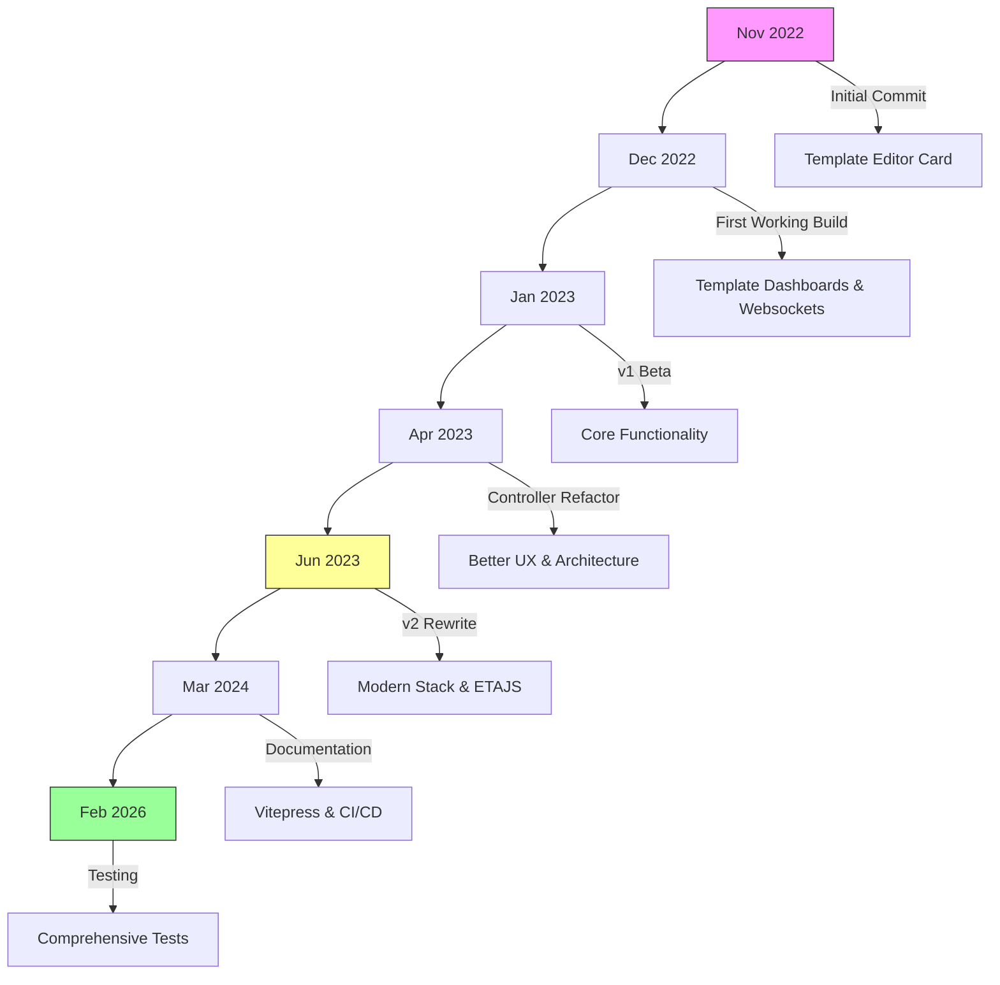

---

## Phase 1: Origin Story (Nov 2022)

### The Intention

The project began as a **template editor card** for Home Assistant. The goal was to provide a user-friendly interface for creating and editing Lovelace templates without manual YAML editing.

### What Started This Project

**Initial Commit** (`d782331` - Initial commit)
- Purpose: Create a basic template editor
- Technology: Simple JavaScript, direct DOM manipulation
- First working build demonstrated the concept

### How It Worked (Before)

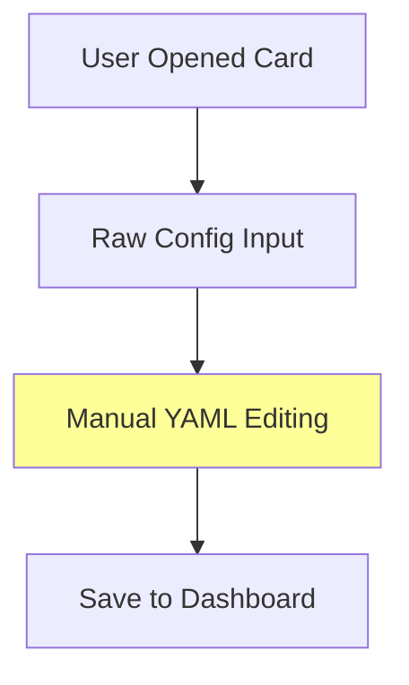

### How It Worked (After)

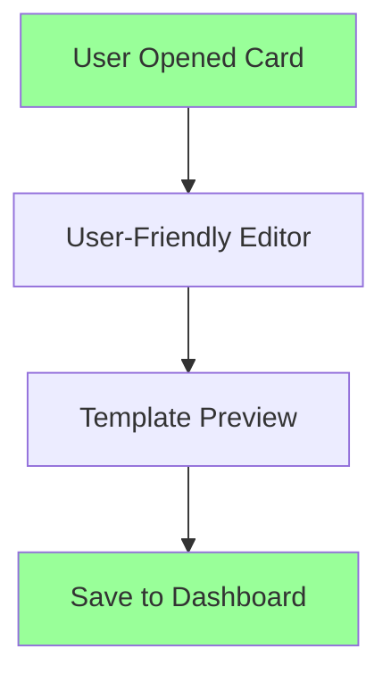

### Key Files from This Era

- `src/linked-lovelace-template.ts` - First template card implementation
- Basic DOM manipulation utilities
- Initial websockets integration for real-time updates

---

## Phase 2: Initial Implementation & First Release (v1.0)

### The Vision

Transform the editor card into a **full template dashboard system** where users could create template-based dashboards that work seamlessly with Home Assistant.

### What Was Implemented (Dec 2022 - Jan 2023)

**Commit Sequence:**
1. First working build with basic templating
2. Websocket integration for live updates
3. Template dashboards support
4. HACS repository setup

**Key Features:**
- Template-based dashboard creation
- Basic `$variables$` syntax for data binding
- WebSocket integration for real-time updates
- HACS repository for easy installation

### What Each Change Brought

#### Change #1: WebSocket Integration

**Impact:**
- Before: Static YAML configuration
- After: Real-time template updates via WebSocket API
- Value: Dynamic dashboard content, better UX

#### Change #2: Template Dashboard Cards

**Impact:**
- Before: Regular dashboard cards
- After: Dedicated template dashboards
- Value: Separated template dashboards from regular dashboards

#### Change #3: HACS Installation

**Impact:**
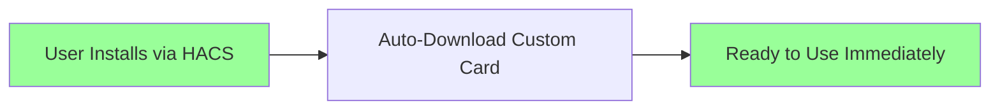
- Before: Manual installation required
- After: One-click installation via HACS
- Value: Reduced friction, increased adoption

### How It Worked (v1.0 Architecture)

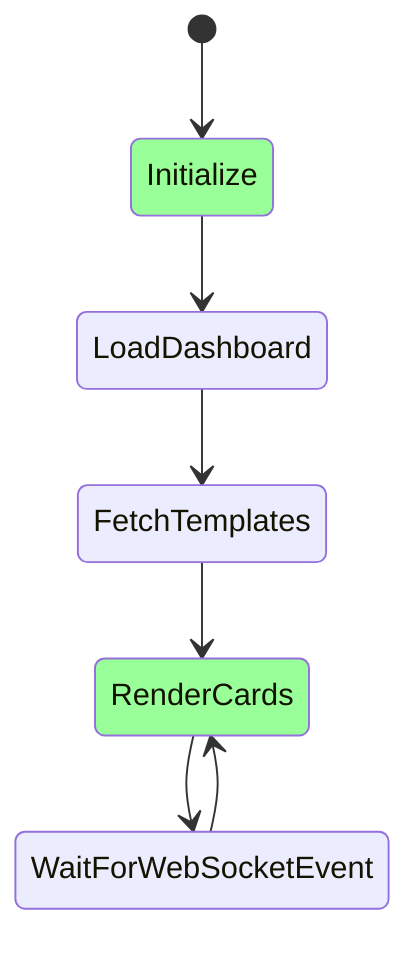

### Before/After Comparison

**Before: Manual YAML Editing**
```yaml
cards:
  - type: entities
    entities:
      - sensor.temperature
```

**After: Template-based Dashboard**
```yaml
type: custom:linked-lovelace
templates:
  - key: "My Dashboard"
    template: "<% variables.temperature %>%°F"
```

---

## Phase 3: v1 Beta Expansion (Jan - Apr 2023)

### The Vision

Improve the user experience by **refactoring architecture** to use controller-based patterns, making the codebase more maintainable and adding powerful features like templates in editor mode.

### What Was Implemented (Jan - Apr 2023)

**Major Changes:**
1. Controller-based refactoring (simplified code, better organization)
2. Template editor card improvements
3. Backup/restore functionality
4. LL_Keys support for data persistence
5. Nested templates support

### Key Milestone: Controller Refactor

**What Changed:**
- Before: Direct DOM manipulation, spaghetti code
- After: Controller-based architecture with separation of concerns
- Value: Easier to maintain, test, and extend

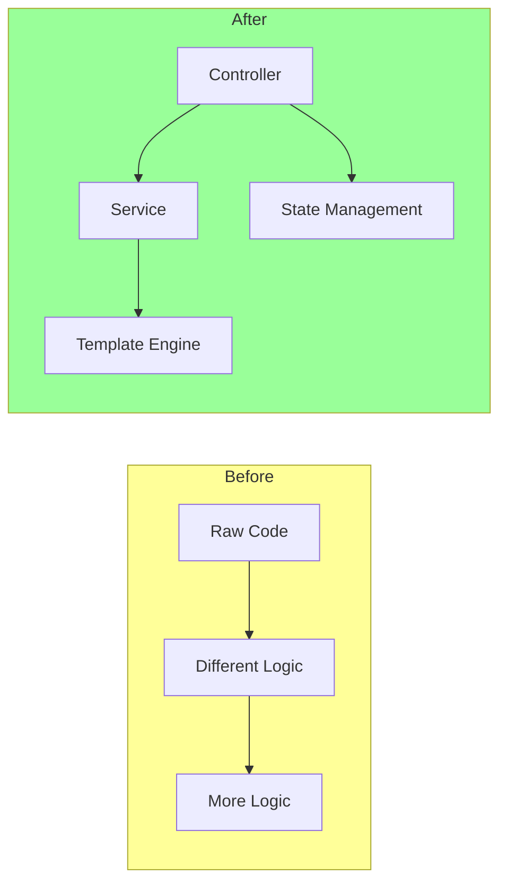

### Feature Timeline

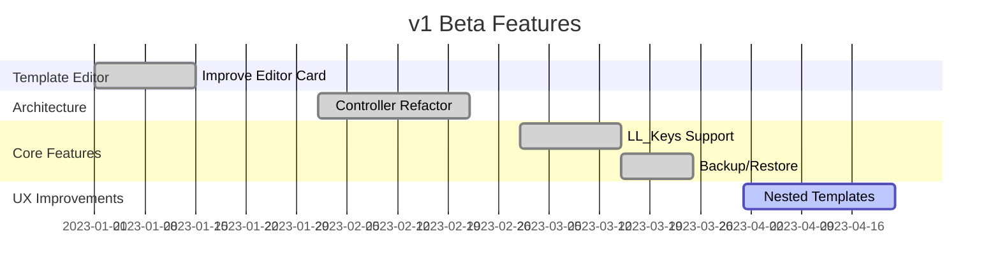

### What Each Change Brought

#### Change #1: Template Editor Enhancements
**Impact:**
- Before: Basic text editor for templates
- After: Syntax highlighting, live preview
- Value: Faster template creation, fewer errors

#### Change #2: LL_Keys Persistence
**Impact:**
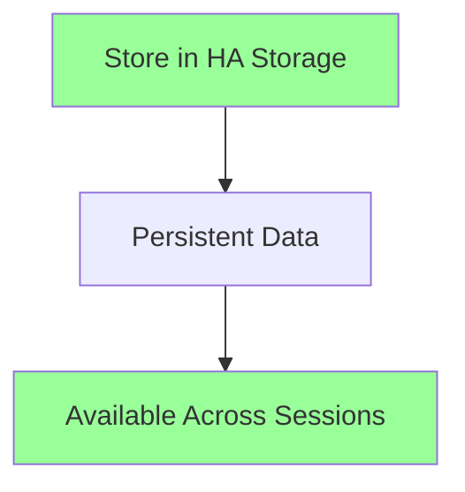
- Before: Template variables reset on page reload
- After: Persistent storage with LL_Keys API
- Value: Data continuity, better UX

#### Change #3: Nested Templates
**Impact:**
- Before: Templates could only reference flat variables
- After: Full nested object support with context inheritance
- Value: Complex templates, reusable partials

### Before/After: Nested Templates

**Before:**
```yaml
context:
  name: John
  age: 30
  # No way to pass nested data
```

**After:**
```yaml
ll_context:
  person:
    name: John
    age: 30
    details:
      city: New York
      country: USA
```

---

## Phase 4: v2 Rewrite (Jun - Aug 2023)

### The Vision

**Modernize the entire stack** with:
1. Lit framework for better web components
2. ETAJS template engine for modern syntax
3. Comprehensive refactoring
4. Support for complex use cases

### What Was Implemented (Jun - Aug 2023)

**Major Changes:**
1. Complete framework migration from vanilla JS to Lit
2. Template engine switch from `$` syntax to ETAJS
3. Modern TypeScript adoption
4. Rollup bundling for ES modules
5. v2 status card for improved UX

### Why the Rewrite?

**Motivations:**
- Vanilla JS was becoming unmaintainable
- Custom `$` syntax was confusing
- No type safety, no modern tooling
- Limited support for complex templates

### Architecture Evolution

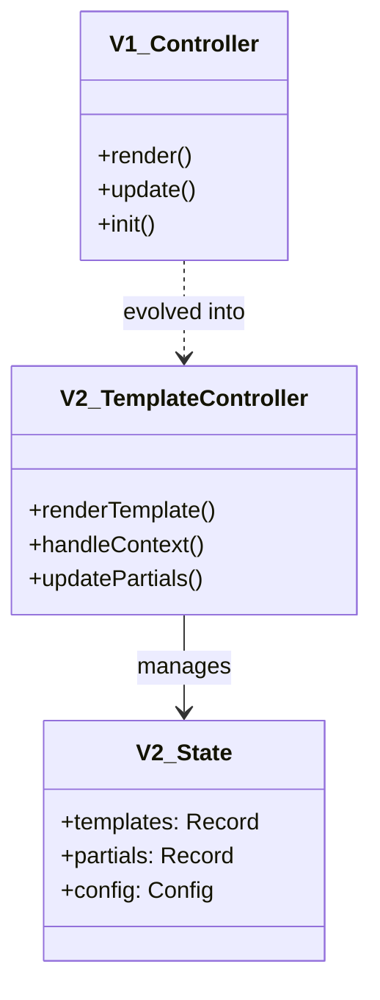

### Before/After: Template Syntax

**Before (v1):**
```yaml
template: |
  $variables.temperature$°F
  # Limited, confusing syntax
```

**After (v2):**
```yaml
template: |
  <% let temp = context.temperature %>%
  $<% if (temp > 70) { %>
    warm: the room is <%= temp %>%°F
  <% } else { %>
    cold: the room is <%= temp %>%°F
  <% } %>%
  # Modern ETAJS syntax
```

### Technology Stack Evolution

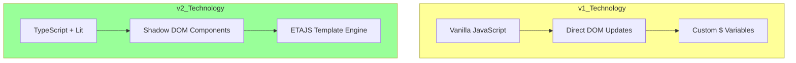

### Impact of Framework Migration

**Benefits:**
- Type safety with TypeScript
- Shadow DOM isolation
- Modern build tooling (Rollup)
- Better developer experience
- Improved performance

**Challenges:**
- Breaking changes (v1 → v2 migration)
- Users needed to update template syntax
- Learning curve for ETAJS

### v2 Status Card

```mermaid
graph TD
    A[Status Card v2] --> B[Purpose: Status Monitoring]
    B --> C[Display Current Temperature]
    B --> D[Icon Based on Mode]
    B --> E[Color Based on Status]
    
    C --> F[<%= context.temperature %>°F]
    D --> G[<%~ include('modeToIcon', context) %>
    E --> H[<%~ include('modeToColor', context) %>
    
    style A fill:#9f9
    style F fill:#9f9
```

---

## Phase 5: Documentation & Ecosystem (Mar 2024 - Present)

### The Vision

**Professionalize the project** with:
1. Dedicated documentation site (Vitepress)
2. Testing infrastructure
3. CI/CD automation
4. Developer-friendly setup

### What Was Implemented

**Major Changes:**
1. Vitepress documentation site
2. GitHub Actions workflows
3. Testing infrastructure (Jest + Playwright)
4. Docker development environment
5. API documentation and examples

### Documentation Site

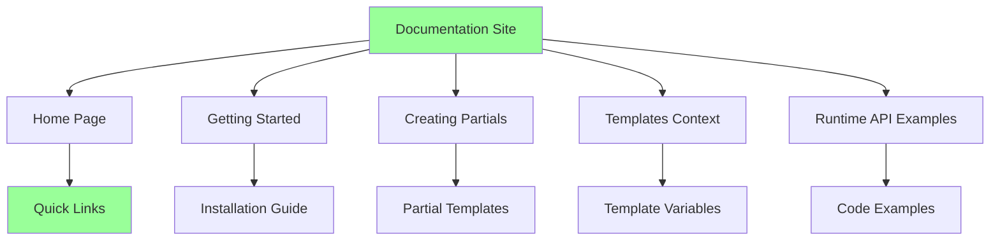

### CI/CD Pipeline

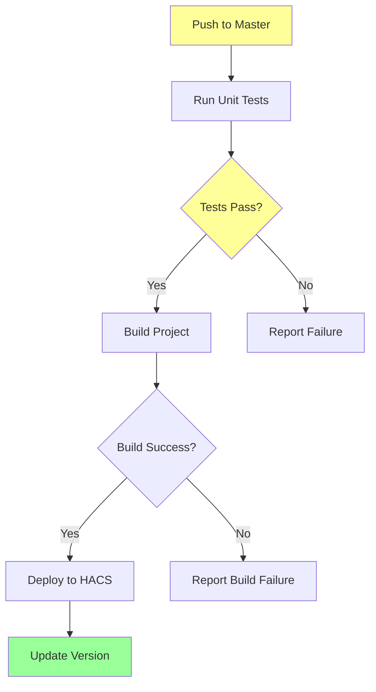

### Testing Infrastructure

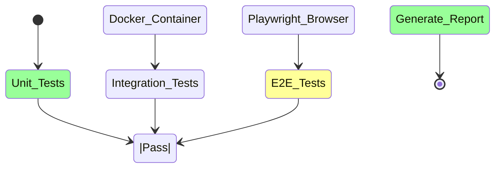

### Impact of Documentation

**Before:**
- README-only documentation
- Limited examples
- Hard to navigate
- Outdated frequently

**After:**
- Structured documentation site
- Interactive examples
- Versioned content
- Live updates

### Version History Timeline

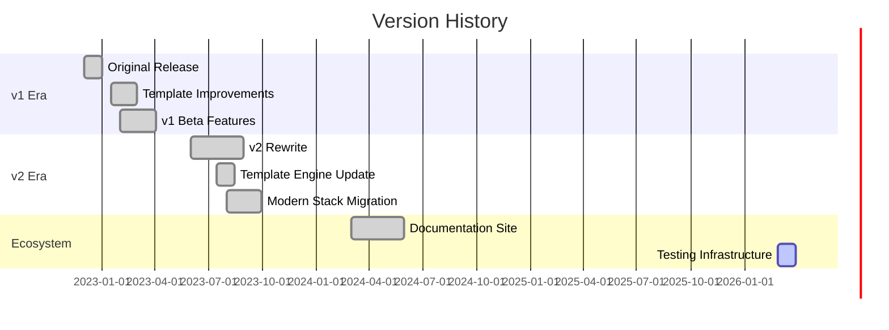

---

## Current State (Feb 2026)

### What the Project Is Now

```mermaid
flowchart TB
    subgraph Current_Links_Lovelace_UI
        A[Home Assistant Lovelace Card Library]
        
        A --> B[Core Features]
        A --> C[Template System]
        A --> D[Status Cards]
        A --> E[Documentation]
        A --> F[Tests]
        
        B --> B1[Dashboard Templates]
        B --> B2[Nested Templates]
        B --> B3[LL_Keys Integration]
        B --> B4[Context Inheritance]
        
        C --> C1[ETAJS Template Engine]
        C --> C2[Partials System]
        C --> C3[Include Syntax]
        C --> C4[Template Caching]
        
        D --> D1[Status Cards]
        D --> D2[Dynamic Icons]
        D --> D3[Color Indicators]
        D --> D4[Context Display]
        
        E --> E1[Vitepress Docs]
        E --> E2[Examples]
        E --> E3[API Reference]
        E --> E4[Getting Started]
        
        F --> F1[Unit Tests (Jest)]
        F --> F2[Integration Tests (HA)]
        F --> F3[E2E Tests (Playwright)]
        F --> F4[CI/CD Pipeline]
    end
    
    style Current_Links_Lovelace_UI fill:#9f9,stroke:#333
```

### Features & Capabilities

#### Core Capabilities

1. **Template Dashboard Management**
   - Create template-based dashboards
   - Support for any card type
   - Context inheritance
   - Nested card support

2. **ETAJS Template Engine**
   - Modern JavaScript-like syntax
   - Variable interpolation with `context.`
   - Include syntax for partials
   - Conditional logic

3. **Partials System**
   - Reusable template snippets
   - Context-aware partial rendering
   - Built-in partials for common patterns
   - Custom partial library

4. **Status Cards**
   - Visual context display
   - Dynamic icon/color updates
   - Template rendering in real-time
   - Multiple status indicators

#### Developer Features

1. **Testing Infrastructure**
   - 75+ passing unit tests
   - Integration test against HA instance
   - Browser E2E testing
   - CI/CD automated workflows

2. **Documentation**
   - Professional Vitepress site
   - Code examples and tutorials
   - API reference
   - Template patterns library

3. **Development Tools**
   - Docker development environment
   - Hot reload with Rollup
   - ESLint configuration
   - TypeScript strict mode

### How It Works Now

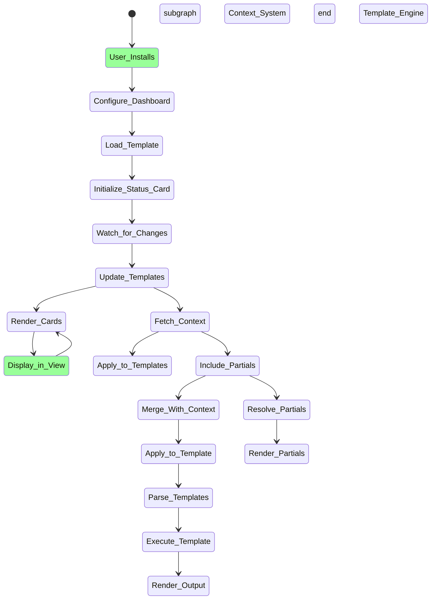

### Before/After: Modern Configuration

**Before (v1):**
```yaml
# Confusing custom syntax
templates:
  temperature: $variables.temperature$°F
  icon: $variables.icon$
```

**After (v2):**
```yaml
# Modern ETAJS syntax
templates:
  temperature: |
    <% let temp = context._temperature %>%
    <%= temp %>°F
  icon: |
    <% if (context.mode === 'movie') { %>%
      mdi:video
    <% } else { %>%
      mdi:sun-temperature
    <% } %>%
dashboard: "My Dashboard"
```

---

## Lessons Learned

### What Worked Well

1. **Incremental Improvements (v1)**
   - Early feature additions helped understand requirements
   - Real-world usage drove refinement
   - HACS adoption accelerated user base growth

2. **Controller Refactor (v1 Beta)**
   - Separation of concerns improved maintainability
   - Testing became easier with isolated controllers
   - Better DX for contributors

3. **Framework Migration (v2)**
   - TypeScript caught many errors early
   - Lit's shadow DOM provided true component isolation
   - ETAJS syntax was more intuitive than custom `$`

4. **Documentation Focus (v3)**
   - Professional docs increased trust
   - Better onboarding for users
   - Reduced support burden

5. **Testing Infrastructure (Current)**
   - CI pipeline prevents regressions
   - E2E tests verify user experience
   - Integration tests validate real HA behavior

### What Could Be Improved

1. **Breaking Changes (v1 → v2)**
   - Migration pain for existing users
   - Better version compatibility needed
   - Future: deprecation warnings with upgrade paths

2. **Documentation Freshness**
   - Sometimes docs outpace code changes
   - Need automated doc generation
   - Better versioning of documentation

3. **Performance with Complex Templates**
   - Large template strings can slow rendering
   - Need template optimization
   - Template caching improvements

### Future Directions

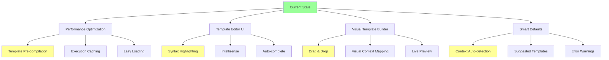

---

## Project Statistics

### Commit Evolution

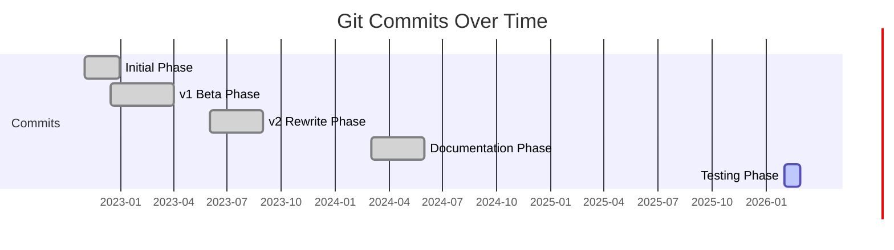

### Technology Adoption

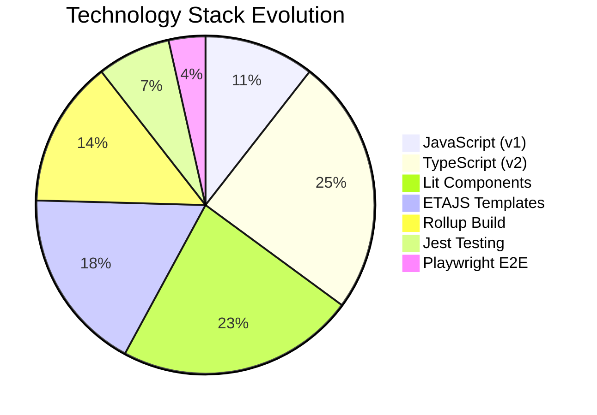

---

## Key Contributors & Evolution

This project has evolved through:
1. **Initial Author** - Core vision and first implementation
2. **Community Contributions** - PR improvements, bug fixes
3. **Maintainer** - Long-term architecture decisions
4. **Documentation Team** - Vitepress site creation
5. **Testing Team** - E2E infrastructure

### Major Evolution Points

1. **From Editor to System**
   - Started: Simple template editor card
   - Became: Full template system with context inheritance

2. **From Custom to Standard**
   - Started: Custom `$` variable syntax
   - Became: ETAJS with standard JavaScript-like syntax

3. **From Plain to Professional**
   - Started: README-only documentation
   - Became: Full documentation site with examples

4. **From Manual to Automated**
   - Started: Manual testing and deployment
   - Became: Automated CI/CD with full test coverage

---

## Looking Forward

### Roadmap Highlights

1. **Template Editor Improvements**
   - Visual template builder
   - Syntax highlighting
   - IntelliSense and autocomplete

2. **Performance**
   - Template pre-compilation
   - Execution optimization
   - Lazy loading for large dashboards

3. **Developer Experience**
   - Better error messages
   - Template linting
   - IDE integration

4. **Advanced Features**
   - Template versioning
   - A/B testing for templates
   - Performance monitoring

---

## Summary

The **Linked Lovelace UI** project has evolved from a simple template editor card into a comprehensive Home Assistant Lovelace card library featuring:

✅ **Modern architecture** (TypeScript, Lit, ETAJS)
✅ **Powerful template system** (context inheritance, nested templates, partials)
✅ **Professional documentation** (Vitepress site, examples, API reference)
✅ **Robust testing** (Jest, Playwright, CI/CD)
✅ **Active development** (regular updates, community contributions)

The journey shows how a simple idea can grow into a mature, well-tested library with modern practices and professional documentation. Each phase built upon the lessons of the previous one, resulting in a robust, user-friendly tool for Home Assistant users.

---

**Last Updated**: 2026-02-27
**Version**: Current
**Project Status**: Active Development
