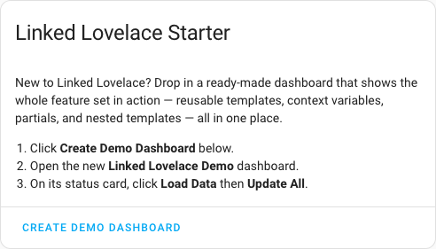
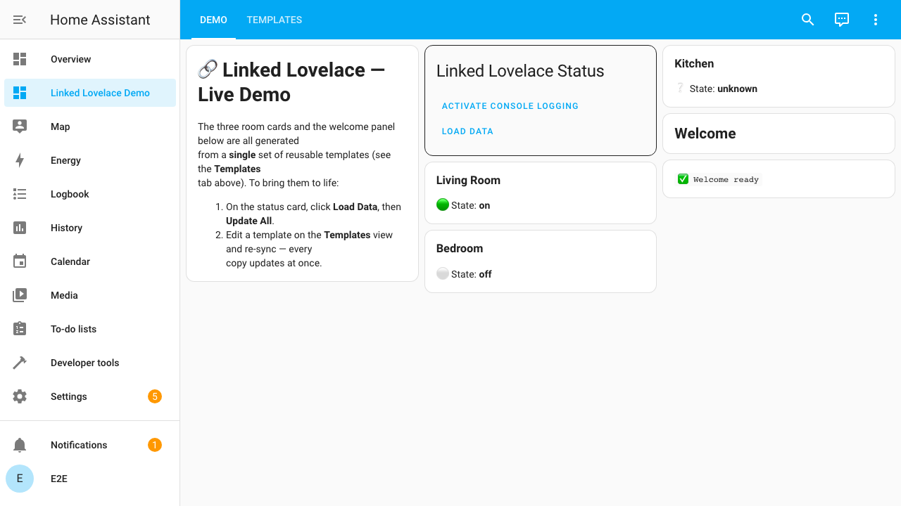

# Starter Dashboard

The fastest way to understand what Linked Lovelace can do is to **see it
running**. The **Starter Card** drops a complete, pre-built demo dashboard into
your Home Assistant with a single click — no copy/paste, no YAML.

In one dashboard it shows the whole feature set:

- **Reusable templates** — one `room` template rendered three times
- **Context variables** — each room gets its own `name` and `state`
- **Partials** — a `stateToIcon` partial turns a state into an icon
- **Nested templates** — a `panel` template that embeds a `badge` template

## 1. Add the Starter Card

On any user-created dashboard, add a card with the type
`custom:linked-lovelace-starter` (it's also in the card picker as
**Linked Lovelace Starter Card**):

```yaml
type: custom:linked-lovelace-starter
```



::: tip Optional
You can override where the demo is created:

```yaml
type: custom:linked-lovelace-starter
url_path: my-linked-lovelace-demo   # default: linked-lovelace-demo
title: My LL Demo                   # default: Linked Lovelace Demo
```
:::

## 2. Create the demo dashboard

Click **Create Demo Dashboard**. Linked Lovelace creates a new dashboard
(`linked-lovelace-demo` by default) and fills it with the showcase config. When
it's done, a link appears — open it from there or from the sidebar.

::: danger NOTE
Like everything in Linked Lovelace, this runs on behalf of **your browser** and
writes a real storage-mode dashboard to your config. It only creates a new
dashboard; it never touches your existing ones.
:::

## 3. Bring it to life

The demo opens on two views:

- **Demo** — the cards you'll actually look at (a status card + the rendered
  output).
- **Templates** — the reusable templates and the partial that power them.

On the **Demo** view's status card, click **Load Data**, then **Update All**.
The room placeholders become fully rendered cards:



Notice that the three room cards — _Living Room_, _Bedroom_, _Kitchen_ — all come
from the **same** `room` template, each with its own context. The 🟢 / ⚪ / ❔
icons come from the `stateToIcon` partial, and the **Welcome** panel is a nested
template (`panel` → `badge`).

## 4. Feel the power

Open the **Templates** view and change the `room` template — for example, add a
line to its `content`. Go back to the **Demo** view and click **Update All**
again. **Every** room card updates at once. That's the whole point of Linked
Lovelace: author once, reuse everywhere, sync on demand.

## Where to next?

- [Creating Your First Template](./create-your-first-template) — build your own
- [Providing Template Context](./providing-template-context) — variables in depth
- [Creating Partials](./creating-partials) — share Eta snippets across templates
- [Using the Status Card](./using-the-status-card) — Load Data, dry-run, Update All
- [Template Syntax](./template-syntax) — the Eta reference
