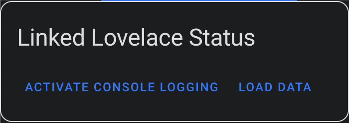
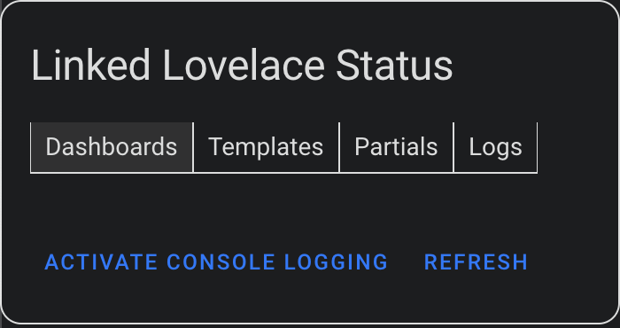
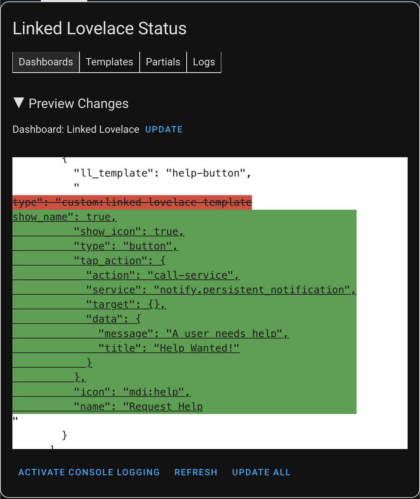
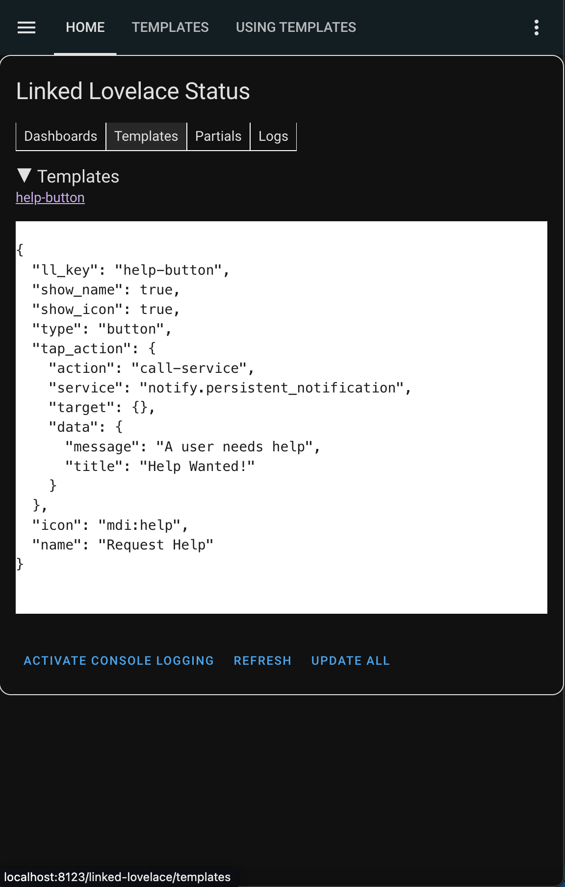

# Using the Status card

It is recommend to use the status card as a singular card in a panel view.

::: danger NOTE

Linked Lovelace runs commands on behalf of the user's browser to modify dashboard configurations, not on behalf of the Home Assistant system. A user's access may modify the outcome of the program.

__Always back-up your configs if you feel unsure about what you are about to do!__
:::

## First Paint

When the card first shows up, it has no information loaded. **_This is intentional._**

In the world of web development, there exists a metric called "Time to First Paint". This represents the amount of time it takes for a user's device to draw something on the screen.

In our case, we want to minimize the time-to-first-paint as the longer this takes, the more resources we are using - A.K.A killing the user's battery.

To this end, the status card performs no actions when being loaded. We wait for user input before collecting information for the card to use.

After first paint, the user should see two buttons - `Activate Console Logging` and `Load Data`.

## Console Logging

`Activate Console Logging` when pressed will cause future actions to output logs to the browser console for local debugging.

- This is disabled by default as it can heavily decrease performance.
- Logs are collected internally still, which can be reviewed once the card has loaded some data.

## Loading Data

`Load Data` when pressed will make a few websocket requests on behalf of the user to determine what dashboards, templates, and partials are available.

- After doing so, it will automatically perform a dry-run with the found changes and store the differences.

## Loaded Tabs

Once data has been loaded, the card will display the following tabs.

### Dashboards

If nothing shows when this is selected, then there is nothing found to update!

If there are updates that can occur, each dashboard will have the code changes minimized, as well as a button to update that specific dashboard. Expand them to review any changes.

There is also a button to update every dashboard in one click. Great for experts, but definitely a risky click after making changes!

### Templates

This tab contains a list of hyperlinks to the templates that are found by Linked Lovelace.

It also has an expansion arrow to quickly check the code for each template.

### Partials

This tab is identical to the templates tab, except that it focuses on all discovered partials. We haven't discussed these yet.

### Logs

This tab contains a scrollable text box featuring logs for each action that has occurred.

If console logging is activated, a more detailed version of each log should be available in the browser logs.

__*This is purely a debugging tool.*__

## Demonstration

Given all we've discussed, let's put it into action.

## What's Next?

At this point you should be capable of creating a template from a new or existing card, using that template in another dashboard, and synchronizing the changes.

With that, you've accomplished everything featured in `Linked Lovelace 1.0`.

In `Linked Lovelace 2.0` the library [Eta JS](https://eta.js.org/) was introduced to provide powerful templating logic. Learn how to make use of this by [providing Template Context.](./providing-template-context)