# Linked Lovelace Architecture Diagrams

## Evolution Timeline

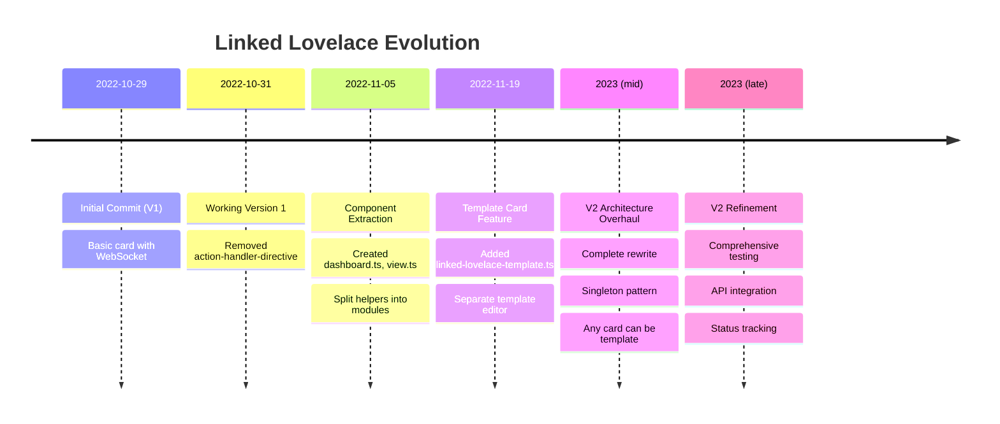

## V1 Architecture

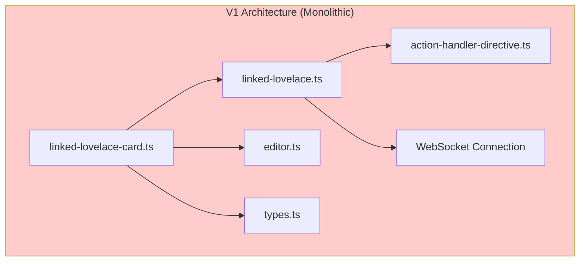

## V2 Architecture (Current)

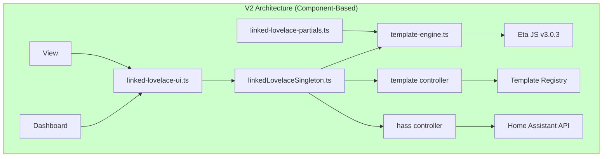

## Data Flow in V2

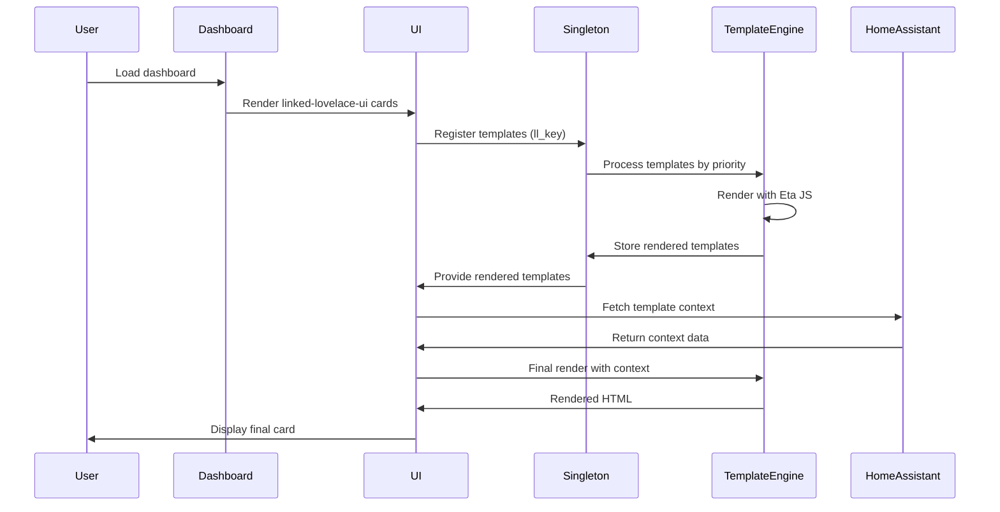

## Template Priority System

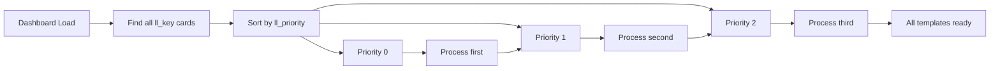

## Template Rendering Pipeline

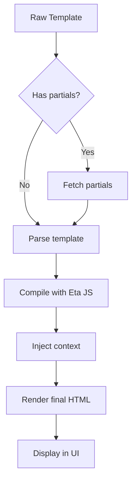

## Test Coverage Structure

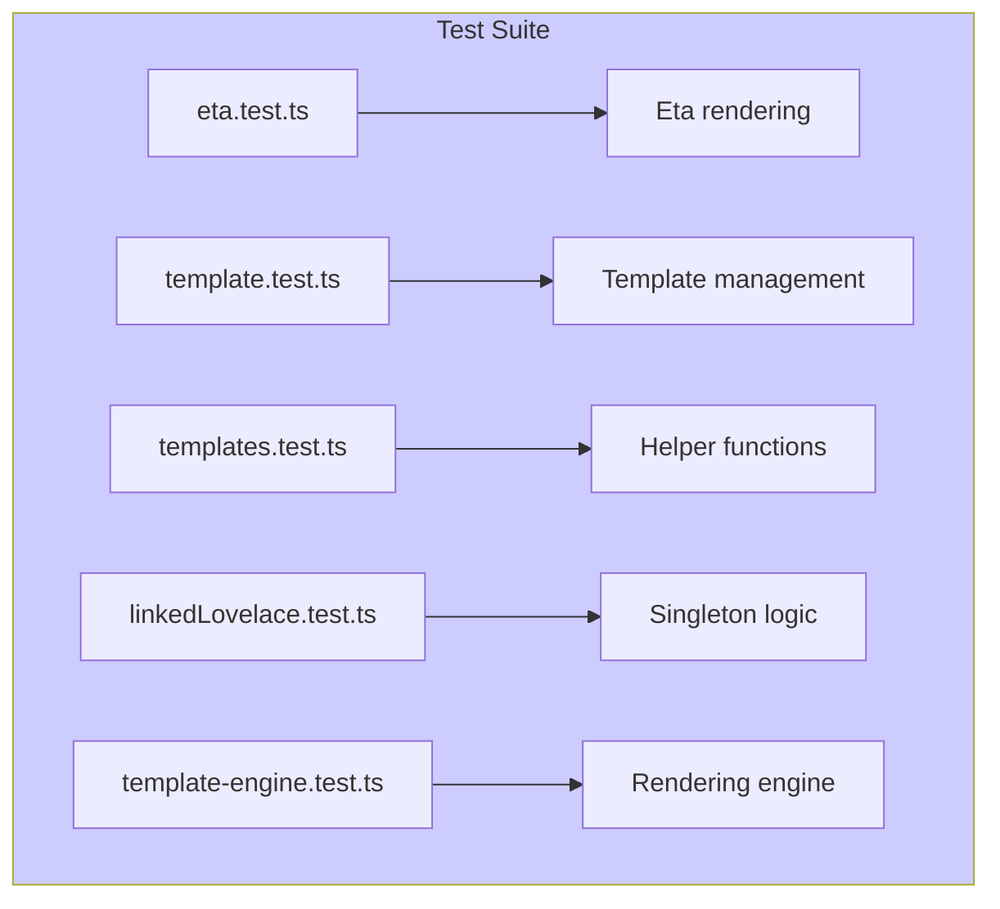

## Optimal System Architecture (Proposed)

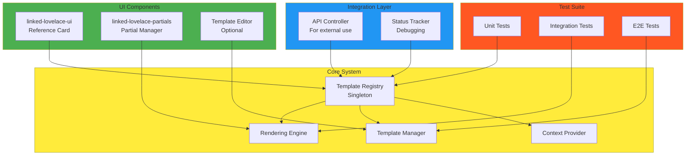

## Migration Path (V1 to V2)

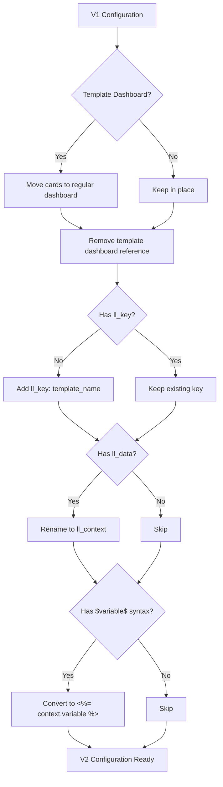

## Key Decisions Impact

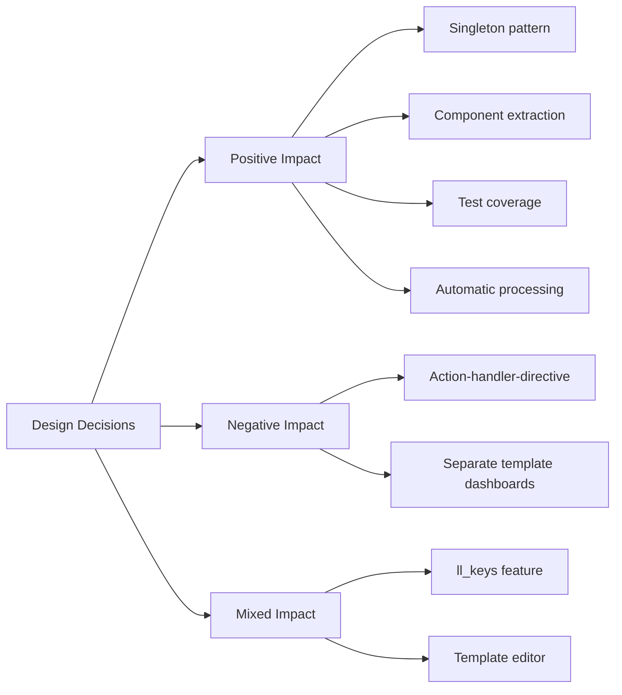

## Regression Timeline

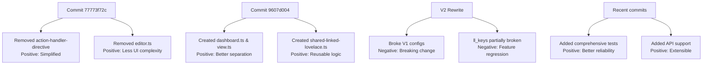
